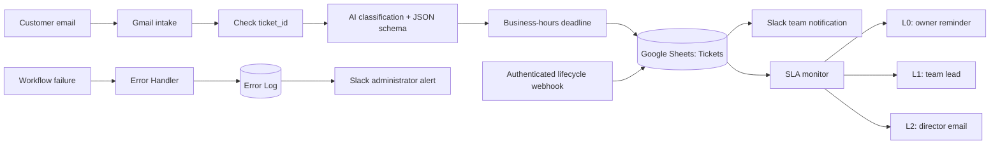

# SupportFlow AI

**AI-assisted ticket routing, first-response SLA monitoring, and controlled ticket lifecycle management.**

A four-workflow n8n demonstration for an online education and consulting agency. Gmail requests become structured tickets; the team receives Slack notifications, overdue tickets escalate, and execution errors are recorded centrally.

> Educational demonstration prototype — not a real client deployment. The assumed business scenario is **35–50 enquiries per day across an eight-person team**. This is a design assumption, not a throughput benchmark.

## The business problem

A shared inbox leaves ownership, urgency, and follow-up dependent on manual triage. Payment problems can compete with routine learning questions, while overdue requests remain difficult to track.

SupportFlow demonstrates a connected process: classify a request, assign one role-based owner, calculate a deadline, notify the team, and track whether the ticket receives a first response.

## How it works



| Workflow | Responsibility |
| --- | --- |
| [Ticket intake](workflows/01-ticket-intake.json) | Gmail polling, duplicate lookup, AI classification, business-hours SLA, ticket storage, Slack notification, Gmail label |
| [SLA monitor](workflows/02-sla-monitor.json) | Open-ticket checks, overdue thresholds, L0/L1/L2 notifications, escalation-state updates |
| [Ticket lifecycle](workflows/03-ticket-lifecycle.json) | Header-authenticated status updates, first-response/resolution timestamps, explicit HTTP 200/404 responses |
| [Error Handler](workflows/04-error-handler.json) | Error context normalisation, Google Sheets error log, Slack alert |

## What the implementation demonstrates

- **Structured AI output:** five categories, four priorities, role-based ownership, summary, sentiment, and a concise decision rationale.
- **Business-hours deadlines:** weekdays, 09:00–19:00 in `Europe/Madrid`, calculated in JavaScript using n8n's DateTime support.
- **Duplicate checks:** existing `ticket_id` values stop the intake path; processed emails receive a `Ticketed` label.
- **Escalation state:** stored levels suppress repeat alerts after a successful state update.
- **Lifecycle control:** `in_progress` and `closed` updates; closed tickets cannot be reopened through this endpoint.
- **Operational visibility:** node retries where configured, a dedicated error workflow, and an error log.

These are prototype safeguards, not guarantees of exactly-once processing or production reliability. See [limitations](docs/LIMITATIONS.md).

## Classification and SLA policy

| Category | Owner role |
| --- | --- |
| `student_support` | `student_success_lead` |
| `academic` | `academic_coordinator` |
| `sales` | `sales_lead` |
| `billing` | `finance_lead` |
| `spam` | No owner; stored as `filtered`, without a team notification |

| Priority | SLA budget in business minutes |
| --- | --- |
| P1 | 30 |
| P2 | 120 |
| P3 | 1,440 |
| P4 | 2,880 |

The SLA monitor targets L0 at the deadline, L1 after 30 overdue minutes, and L2 after 60 overdue minutes. **Overdue time uses elapsed minutes, not the business-hours calendar.** If a check first sees a ticket at L2, it sends the highest applicable level rather than replaying all earlier levels.

AI selects the category, priority, owner, and SLA budget. The output parser constrains their allowed values; JavaScript calculates deadlines and escalation thresholds. The prototype does not yet enforce every relationship between those fields deterministically.

## Evidence and validation

The portfolio previously reported **10/10 test requests**, L0/L1/L2 escalation checks, HTTP 200/404 lifecycle paths, and an observed runtime error handled by the Error Handler. Those are historical demonstration results, not a benchmark of the sanitized exports. Original execution logs are not included here.

This package adds offline structural, sanitization, and selected Code-node regression checks. It does **not** call Gmail, Slack, Google Sheets, or OpenAI, and does not establish classification accuracy or end-to-end integration success.

```sh
npm test
```

No package installation is required for these tests. Use Node.js 22 or newer.

## Run your own demonstration

1. Follow the [setup guide](docs/SETUP.md).
2. Import the four JSON files into a **separate test environment**.
3. Reconnect credentials, tables, channels, recipients, Gmail labels, and the error workflow.
4. Complete the [integration checklist](docs/VALIDATION.md) with synthetic data before publishing any trigger.

All exports are inactive and contain placeholders. **They are not ready to execute immediately after import.** The exact source n8n application version was not included in the exports; node versions are retained in each JSON file.

The repository documentation is English. Original Ukrainian node labels, prompts, and notification text are intentionally preserved to keep expressions and the demonstrated classifier behaviour unchanged.

## Walkthrough and contact

- [Loom demonstration — Ukrainian narration](https://www.loom.com/share/a50ba31d53bd4d0f92ce9712a5c29098)
- [AI Automation portfolio](https://vladyslav-ai-automation.notion.site/AI-Automation-Portfolio-3917a4cb52cc81408f7cebb09a5d14ce)
- [Vladyslav Moskalkov on LinkedIn](https://www.linkedin.com/in/vladyslav-moskalkov/)

## Security and reuse

Credential references, personal email addresses, spreadsheet URLs/IDs, Slack channel IDs, Gmail label IDs, and deployment metadata were removed or replaced in the public-preparation copies. Original files were not changed. Review [SECURITY.md](SECURITY.md) before importing or sharing exports.

No open-source license has been selected yet. A public repository does not by itself grant unrestricted reuse rights.
